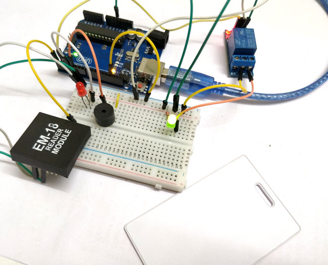

# Project-14: Arduino RFID Door Lock
## Problem Statement
In this project we are using Arduino and relay to trigger the Electric Door Lock and RFID to authenticate, so your RFID tag will act as a key. If you place wrong RFID card near RFID reader a buzzer will beep to alert about wrong card.

## Description
Each RFID card has a unique ID embedded in it and a RFID reader is used to read the RFID card no. EM-18 RFID reader operates at 125 KHz and it comes with an on-chip antenna and it can be powered with 5V power supply.

The output provided by EM-18 RFID reader is in 12 digit ASCII format. Out of 12 digits first 10 digits are card number and the last two digits are the XOR result of the card number. Last two digits are used for error checking.

In our circuit, we have already saved the value of RFID tag in the code. So, whenever that particular tag comes in range, the relay gets activated. Here we have connected a LED with Relay to demonstrate, but this LED can be replaced by an Electric Door Lock, so that whenever the Relay gets activated the lock will be opened. If we scan any other RFID card, the buzzer will start beeping as it’s the wrong RFID tag.

## Personal Comments
Learnt how a EM-18 RFID Reader works.
