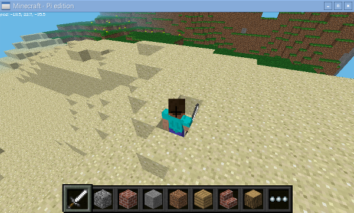

# Project-15: Micromine Bitcraft
## Problem Statement
This project uses the accelerometer sensors on the micro:bit and some extra buttons to play Minecraft.

## Description
We will use a micro:bit to help (or sabotage!) Steve in Minecraft by connecting the pins on your micro:bit to the General-Purpose Input/Output (GPIO) pins on a Raspberry Pi using some cables and crocodile clips. Then, using Python, you will write programs to detect motion from the micro:bit’s accelerometer and make Steve shake in Minecraft.
### Connections
* Connect one female-to-male jumper wire to the GPIO 17 pin on the Raspberry Pi
* Clip the crocodile clip to the male end of the jumper wire
* Clip the other end of the crocodile clip to pin 0 on the micro:bit
* Then repeat the steps above with GPIO 27 on the Raspberry Pi (which is next to GPIO 17), connecting it to pin 1 on the micro:bit
## Personal Comments
Learning Outcomes:
* How to connect a micro:bit to a Raspberry Pi
* How to program the micro:bit and Minecraft using Python
* How to connect and program the buttons and pins on the micro:bit and Raspberry Pi to detect motion
