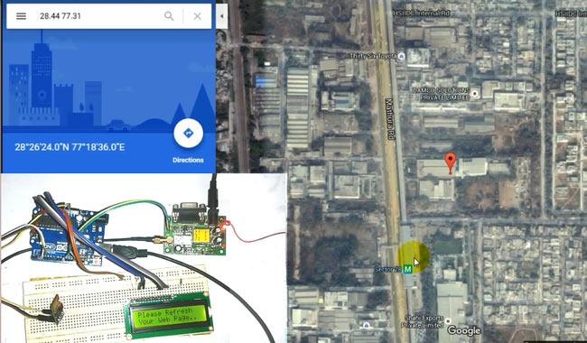

# Project-17: Arduino Vehicle Tracker using ESP8266, GPS and Google Maps
## Problem Stetement
Build a device which can get coordinates of the vehicle using GPS Module and show the location on Google Maps.

## Description
In this project, we will send the location coordinates to the Local Server and you just need to open a ‘webpage’ on your computer or mobile, where you will find a Link to Google Maps with your Vehicles Location Coordinates. When you click on that link, it takes you on Google Maps, showing your vehicles location. In this Vehicle Tracking System using Google Maps, GPS Module is used for getting the Location Coordinates, Wi-Fi module to keep send data to computer or mobile over Wi-Fi and Arduino is used to make GPS and Wi-Fi talk to each other.
## Personal Comments
* Learnt how to send data to a webpage
* Learnt how to communicate with the GPS Module using Arduino
