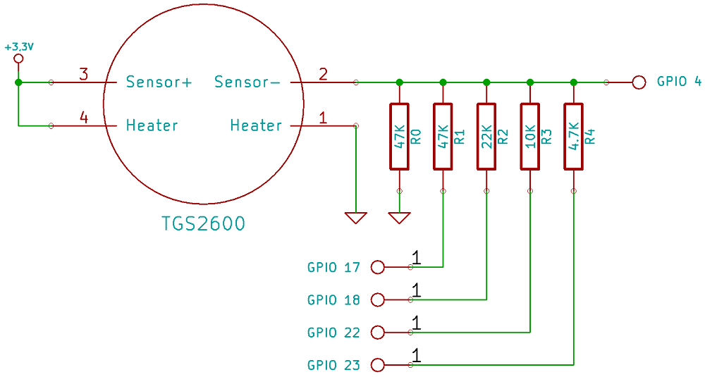

# Project-2: Fart Detector using RPi
## Problem Statement
Building a Fart Detector which can sense and provide the advance warning necessary to evacuate the room.
## Description
The main component is the air quality sensor which gives a higher voltage as output for more contaminated air.

Next take a 47kΩ resistor (resistors are colour coded to help you identify them) and connect it between the sensor output and ground. This will siphon off a portion of the voltage coming from the sensor output, to help bring it down to the 1.1 to 1.4 volt region of the GPIO threshold for our trigger pin. This single resistor is not going to be enough to get the job done though.
### Build a resistor ladder DAC
The problem we now have is that despite the addition of the 47kΩ resistor, the air quality sensor has quite a large output voltage range. The resistor ladder DAC (Digital to Analog Converter) brings the voltage down to just below the GPIO threshold, under different air quality conditions.

So far only the 47kΩ R0 is present on your breadboard, which is hard-wired directly to ground. The other resistors (R1 to R4) are each connected in parallel to a different GPIO pin. This gives us digital control over whether each resistor is on or off. If we configure the GPIO pin to use INPUT mode this switches the resistor off, because the GPIO pin is not internally connected to anything. However, if we set it to use OUTPUT mode and then drive the pin LOW, this will connect the resistor to ground and some voltage will be siphoned off through it.

## Personal Comments
Learning Outcomes:
* Understand how an air quality sensor works
* Make a rudimentary DAC (digital to analogue converter)

Code (fart.py) is attached.
