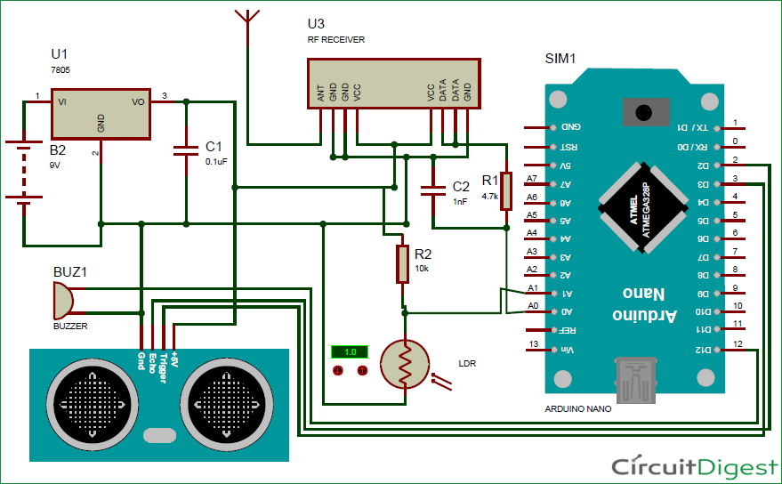

# Project-20: Smart Blind Stick
## Problem Statement
Smart Blind stick to aid the blind and act as a warning system.

## Description
This Smart stick will have an Ultrasonic sensor to sense distance from any obstacle, LDR to sense lighting conditions and a RF remote using which the blind man could remotely locate his stick. All the feedbacks will be given to the blind man through a Buzzer.

This Arduino Smart Blind Stick Project requires two separate circuits. One is the main circuit which will be mounted on the blind man’s stick. The other is a small remote RF transmitter circuit which will be used to locate the main circuit.

## Personal Comments
Learnt how to use 433MHz RF transmitter and receivers and Ultrasonic sensor.
