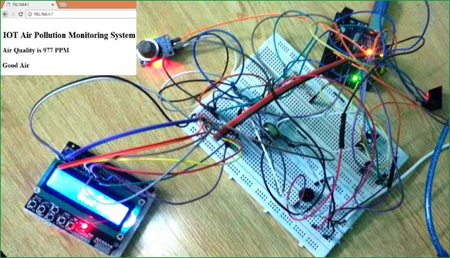

# Project-21: IoT based Air Pollution Monitoring System using Arduino
## Problem Statement
Make an IoT Based Air Pollution Monitoring System in which we will monitor the Air Quality.

## Description
The MQ135 sensor can sense NH3, NOx, alcohol, Benzene, smoke, CO2 and some other gases, so it is perfect gas sensor for our Air Quality Monitoring Project. When we will connect it to Arduino then it will sense the gases, and we will get the Pollution level in PPM (parts per million).

When the value will be less than 1000 PPM, then the LCD and webpage will display “Fresh Air”.  Whenever the value will increase 1000 PPM, then the buzzer will start beeping and the LCD and webpage will display “Poor Air, Open Windows”. If it will increase 2000 then the buzzer will keep beeping and the LCD and webpage will display “Danger! Move to fresh Air”.

## Personal Comments
Learnt how to work with MQ135 sensor and how to send data over a webserver.
