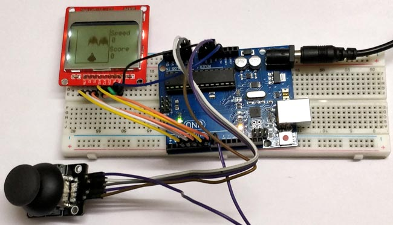

# Project-25: Space Race Game using Arduino and Nokia 5110 Graphical Display
## Problem Statement
Make a Space Race Game where you need to keep your ship safe from enemy ships using joystick.

## Description
Space ship that is racing through the aliens spaceships, this spaceship will have three lanes to changes in order to avoid a hit with the aliens. At all time the aliens can occupy only two track and the player should be able to drive through the free track.

The game gets input from the joystick which is used to switch between the three lanes.

The Nokia 5110 Display can display bitmap images, so we converted the spaceship and enemy spaceship into bitmap images to be displayed.

## Personal Comments
* Learnt how to display bitmap images and text on the Nokia 5110 Display.
* Learnt how to use and connect joystick.
