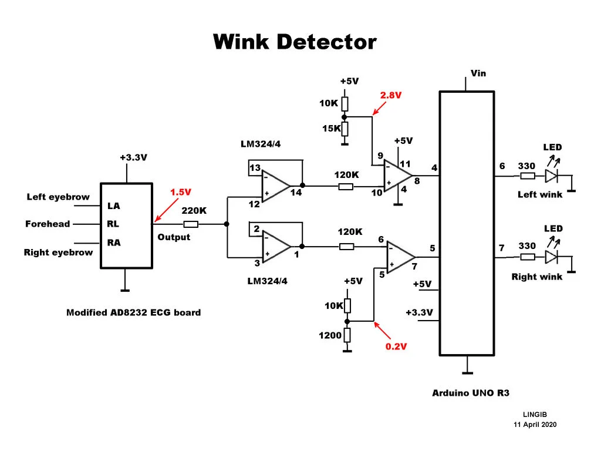

# Project-3: Wink Detector
## Problem Statement
Making a “Wink Detector” from a modified AD8232 ECG (electrocardiogram) sensor.
## Components
* AD8232 ECG (electrocardiogram) sensor
* LM324-N quad op-amp
* Arduino Uno R3
* Home-made head-band
## Description
The detector has two outputs, one for when you wink your left eye, one for when you blink your right eye. Normal blinks which involve both eyes are ignored.

The output waveform from the AD8232 hovers about 1.5 volts DC.

When the left-eye winks the AD8232 output wave form rises towards 3.3 volts. When the waveform exceeds 2.8 volts the left-wink comparator output changes from zero to 5 volts.

When the right-eye winks the AD8232 output wave form falls towards zero volts. When the waveform falls below 0.2 volts the right-wink comparator output changes from zero to 5 volts.

Normal blinks have no effect on the output as they are the equivalent of two simulataneous winks and it’s not possible for the AD8232 output to go in two opposite directions at the same time.
## Circuit

