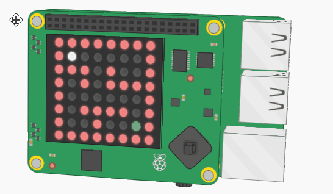

# Project-4: Sense HAT Marble Maze with RPi
## Problem Statement
Create a marble maze game that can be played on the LED matrix of your Sense HAT.

## Description
This project uses the Sense HAT board which is attached to the RPi and creates a Marble Maze game which can be played on the LED Matrix of the Sense HAT.

The code stores the maze as an 8x8 matrix. The goal is to get the while marble to the target (green LED) by tilting the board in the target direction.

This code gets data from the Sense HAT board as the Sense HAT library can detect pitch, roll, and yaw from the onboard sensors.

It uses an alrorithm to change the x, y positions and make sure the while marble does not go into walls or out of the 8x8 LEDs.
## Personal Comments
### Learning Outcomes
* Illuminate Sense HAT pixels
* Capture pitch, roll, and yaw data with the Sense HAT’s orientation sensors
* Implement a basic form of collision detection
You will need to import the Sense HAT Library to run the code.
