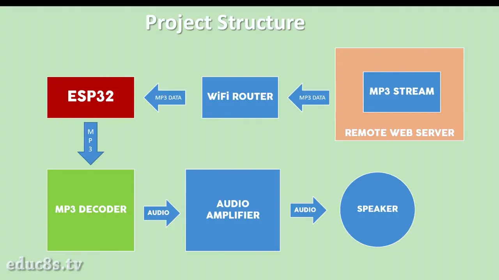

# Project-5: Internet Radio
## Problem Statement
Build an Internet radio device with a 3.5” display using an ESP32 board.
## Components
* ESP32
* MP3 Decoder
* Amplifier
* 3W Speaker
* 3.5" Nextion Display
* Push buttons
## Description
The ESP32 board connects to the Internet and then it receives MP3 data from the radio station we are listening to, and it sends some commands to the display.

The MP3 data is then sent to the MP3 decoder module using the SPI interface. This module uses the VS1053 IC. This IC is a dedicated hardware MP3 decoder. It gets the MP3 data from the ESP32 and converts it really fast into an audio signal. The audio signal that it outputs at this audio jack is weak, so we need to amplify it. That’s why we use a PAM8403 audio amplifier to amplify the audio signal and then send it to a speaker.

## Personal Comments
* Learnt how to connect and use MP3 decoder module with ESP32 board.
* Learnt how to connect the ESP32 to WiFi and get data.
