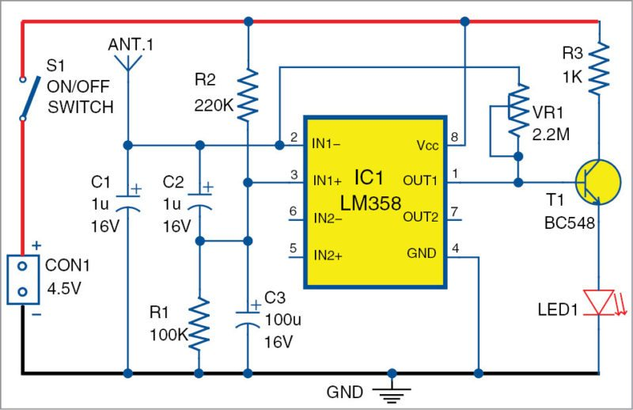

# Project-8: Cellphone detecting circuit
## Problem Statement
Making a circuit which can detect the presence of a cellphoneby detecting RF signals. It can be used in highly secure places and exam halls where phones are forbidden or for spying purposes.
## Components
* Antenna
* capacitor
* resistors
* LM358 IC
* Bipolar Junction Transistor (BJT)
* a potentiometer
* an LED
* battery
## Circuit

## Description
The antenna receives the RF signals and converts it into a voltage.

This  causes  a  small  voltage  difference  across  the  capacitor  which  is transferred to the input of the amplifier IC (LM358).

When  the  voltage  is   amplified  by  the  IC,  the  amplified  voltage  is approximately equal to VCC.

This  is   connected  to  the  base  of   the  BJTwhich  in  this  case  is  a potentiometer.

Here,  the  BJT  acts  like  switch,  when  the  voltage  is  received  from  the output of the amplifier, the BJT turns on and it leads to the LED blinking.
## Personal Comments
* Learnt how to use and connect a Bipolar Junction Transistor (BJT) and how it acts like a switch.
* Learnt how the LM358 IC works and its connections.
